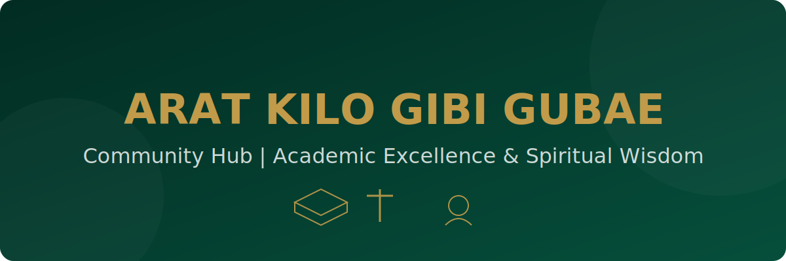

<div align="center">
  
  
  <br>
  
  

  <p><i>A premium, unified hub for Orthodox Tewahedo students' academic and spiritual journey.</i></p>

  [](https://github.com/soltsega/Arat-Kilo-Gbi-Gubae-Community-Hub/)
  [](https://web.dev/progressive-web-apps/)
  [](https://github.com/soltsega/Arat-Kilo-Gbi-Gubae-Community-Hub/)
</div>


## 🌟 Project Overview
The **Arat Kilo Gibi Gubae Community Hub** is a professional digital ecosystem designed to serve the spiritual and academic needs of Orthodox Tewahedo students. Built with a **mobile-first philosophy** and a premium **Glassmorphism UI**, it bridges the gap between campus life and spiritual growth.


## 🚀 Key Functionalities

### 🏆 Quiz Mastery & Automated Leaderboard
A sophisticated engagement system that tracks and rewards spiritual knowledge:
- **Weighted Scoring Logic (50/25/25)**:
  - **50% Participation**: Consistency is key.
  - **25% Accuracy**: Precision in knowledge.
  - **25% Speed**: Mental agility (optimized for sub-50s responses).
- **Real-Time Podium**: Dynamic celebration of top performers.
- **Smart Remarks**: Humorous and spiritual feedback tailored to user performance.

### 📚 Integrated Resource Hub
Dual-layered repository for holistic growth:
- **Academic Support**: Subject notes, old examinations, and model papers for Engineering and Natural Sciences.
- **Spiritual Wisdom**: Gospel summaries (Matthew, Mark, etc.) and Orthodox Tewahedo teachings.
- **Tabbed Interface**: Seamless switching between academic and spiritual content.

### 🎓 Courses & Certifications
A premium portal for structured spiritual growth:
- **Curriculum-Based Learning**: Deep dives into scripture and church tradition.
- **Certification Paths**: Recognizing milestones in spiritual education.
- **Coming Soon Interface**: Glassmorphism cards with premium animations (በቅርቡ ጠብቁን).

### 💬 Feedback & Review System
Community-driven improvement through a robust feedback loop:
- **Google Sheets Integration**: Submissions are automatically synced to cloud spreadsheets via apps scripts.
- **Dynamic Subject Filtering**: Feedback categorized by Bug Reports, Feature Requests, or General Feedback.
- **Seamless UI**: Native browser validation and success states.

### 📱 Premium PWA & UI
The hub is more than just a website:
- **Offline Ready**: Via `manifest.json` and standardized PWA meta tags.
- **Persistent Dark Mode**: A sophisticated "Deep Green & Gold" aesthetic with a subtle noise background pattern.
- **Mobile Optimized**: Zero-scaling viewport logic and responsive layouts.


## 🛠️ Technology Stack

| Layer | Technologies |
| :--- | :--- |
| **UI/UX** | Glassmorphism, Vanilla CSS, HSL Theming, SVG Icons |
| **Frontend** | HTML5, Modern Canvas API, SEO Meta Layer, PWA |
| **Backend** | Python 3.11, FastAPI (Scoring Engine), Pandas (Data Processing) |
| **Database** | CSV-to-JSON Pipeline, Google Sheets API (v4) |
| **DevOps** | Docker, Docker-Compose, Nginx (Reverse Proxy) |


## 🛰️ Community Connectivity
We unify the Orthodox Tewahedo student body across campuses through our digital presence:
- **Main Telegram**: [@gubaeze4k](https://t.me/gubaeze4k)
- **Gallery Channel**: [@gallery_ze4k](https://t.me/gallery_ze4k)
- **Official Portal**: Arat Kilo, Amst Kilo, Sidist Kilo, and Saint Peter's hubs.


## ⚙️ Installation & Setup

### Local Development
```bash
# Clone the repository
git clone "https://github.com/soltsega/Arat-Kilo-Gbi-Gubae-Community-Hub/"

# Initialize Environment
python -m venv venv
source venv/bin/activate  # Windows: venv\\Scripts\\activate

# Install Dependencies
pip install -r requirements.txt

# Start Development Server
python scripts/generate_rankings.py
python scripts/main.py
```

### Production Deployment
```bash
docker-compose up -d --build
```


<div align="center">
  <p><b>Maintained by Solomon Tsega</b></p>
  <p><i>Computer Science Student, Addis Ababa University (AAU)</i></p>
  
  [](mailto:tsegasolomon538@gmail.com)
  [](https://linkedin.com/in/solomontsega)

  <br>
  <p>© 2026 Arat Kilo Gibi Gubae. Academic Excellence & Spiritual Wisdom.</p>
</div>
