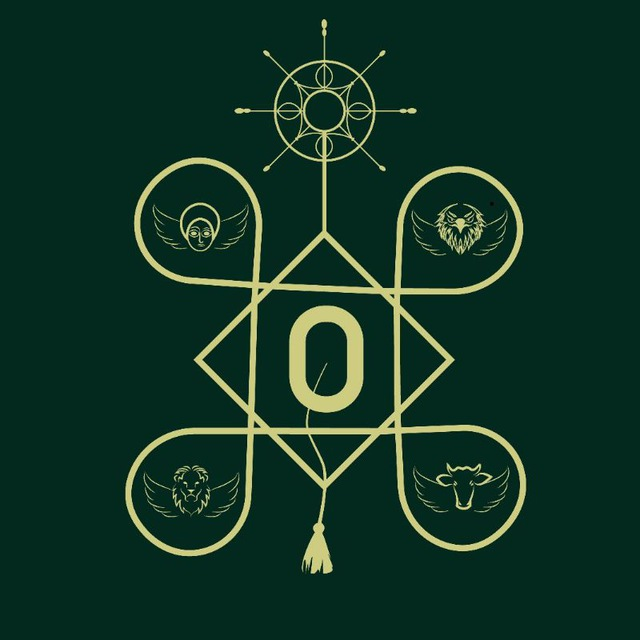

<div align="center">
  
  <h1>Arat Kilo Gibi Gubae - Community Hub</h1>
  <p><i>Academic Excellence & Spiritual Wisdom</i></p>

  [](https://www.python.org/)
  [](https://fastapi.tiangolo.com/)
  [](https://www.docker.com/)
  [](https://github.com/soltsega/Arat-Kilo-Gbi-Gubae-Community-Hub/)
</div>

---

## 🌟 Project Overview
The **Arat Kilo Gibi Gubae Community Hub** is a professional, multi-faceted platform designed to serve the divine and academic needs of the Orthodox Tewahedo students' community. It serves as a unified digital home for academic excellence, spiritual wisdom, and campus connectivity, bridging the gap between various campuses and batches.

The platform is built with a **mobile-first philosophy**, offering PWA (Progressive Web App) features that provide a premium, app-like experience for daily spiritual and academic life.

---

## 🏛️ Core Pillars

### 🎓 Academic Excellence
Providing robust support for the "Arat Kilo" (Addis Ababa University) academic journey:
- **Resource Repository**: Curated subject notes for engineering, natural sciences, and computer science.
- **Exam Archives**: Access to past midterm and final examinations with model solutions.
- **Peer Coordination**: A space for senior-to-junior knowledge transfer and guidance.

### ⛪ Spiritual Wisdom
Deepening the roots of Orthodox Tewahedo faith:
- **Gospel Studies**: Comprehensive summaries and interactive Q\u0026A.
- **Study Guides**: Spiritual materials tailored for students' spiritual growth during their university years.
- **Session Notes**: Digital archives of teachings from regular Gibi Gubae gatherings.

### 🤝 Community Connectivity
Unifying the Orthodox Tewahedo student body across campuses:
- **Campus Directory**: Quick access to official channels for Arat Kilo, Amst Kilo, Sidist Kilo, and Saint Peter's campuses.
- **Batch Integration**: Dedicated communication bridges for all active batches (2015\u20132018 E.C.).
- **Ecclesiastical Portal**: Direct links to EOTC official media, Mahibere Kidusan (MK), and Tewahedo Media Center (TMC).

### 🏆 Engagement \u0026 Gamification
Encouraging active participation through the **Quiz Mastery System**:
- **Cumulative Leaderboard**: Automated performance tracking with real-time ranking.
- **Personalized Feedback**: Humorous and spiritual remarks (Click-to-Reveal) based on cumulative performance.
- **Podium Recognition**: Celebrating top performers to foster healthy academic and spiritual competition.

---

## ⚙️ Technical Details

### 📊 Weighted Scoring Logic
The engagement system uses a balanced **50/25/25** formula:
*   **50% Participation**: Rewards consistency (User Quizzes / Max Quizzes).
*   **25% Accuracy**: Rewards quality of knowledge (User Avg Score / Max Avg Score).
*   **25% Speed**: Rewards mental agility (\u2264 50s = Full Points; \u003E 50s = Weighted Score).

### 🛠️ Technology Stack
| Layer | Technologies |
| :--- | :--- |
| **Frontend** |    |
| **Backend** |    |
| **DevOps** |   |

---

## 🚀 Getting Started

### Quick Start (Local)
```bash
# Clone and prepare
git clone "https://github.com/soltsega/Arat-Kilo-Gbi-Gubae-Community-Hub/"
cd Arat-Kilo-Gbi-Gubae-Community-Hub

# Set up environment
python -m venv venv
source venv/bin/activate  # On Windows: venv\Scripts\activate
pip install -r requirements.txt

# Generate data and start server
python scripts/generate_rankings.py
python scripts/main.py
```

### Production Setup
```bash
docker-compose up -d
```

---

## 🌐 Digital Presence
- **Hub Dashboard**: [http://localhost](http://localhost)
- **Interactive API Docs**: [http://localhost:8000/docs](http://localhost:8000/docs)

---

<div align="center">
  <p><b>Maintained by Solomon Tsega</b></p>
  <p><i>Computer Science Student, AAU</i></p>
  <a href="mailto:tsegasolomon538@gmail.com"></a>
  <a href="https://linkedin.com/in/solomontsega"></a>
  <br><br>
  <p>© 2026 Arat Kilo Gibi Gubae. Academic Excellence \u0026 Spiritual Wisdom.</p>
</div>
